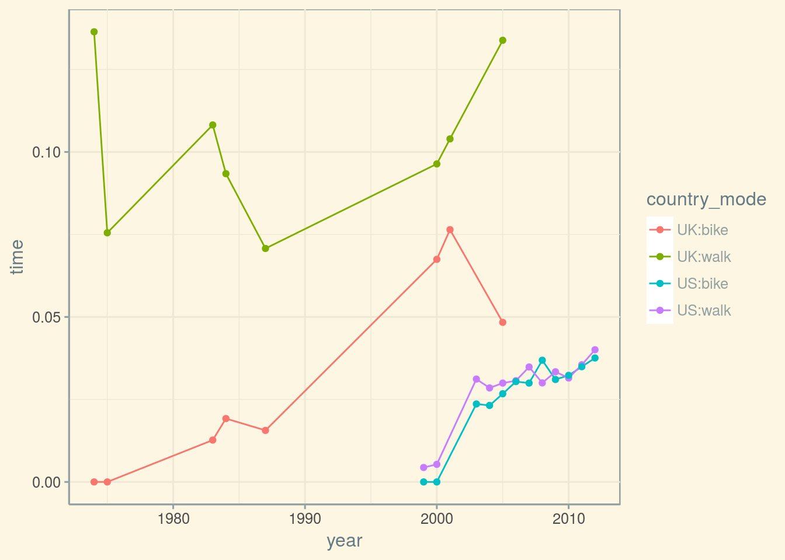

<!-- README.md is generated from README.Rmd. Please edit that file -->
Multinational Time Use Study Analysis of Active Transport
=========================================================

This repository contains just one script used to analyse changes in transport behaviour over time. The data were obtained from the [Multinational Time Use Study (MTUS)](https://www.ipums.org/timeuse.shtml), part of the [Integrated Public Use Microdata Series (IPUMS)](https://www.ipums.org). MTUS data are jointly hosted by the Minnesota Population Center at the University of Minnesota, and the [Centre for Time Use Research](https://www.timeuse.org/mtus) at the University of Oxford.

Data downloads are accompanied by a corresponding "ddi" file, included here both in [`.xml`](./data/mtus_00001.xml) and [plain text](./data/mtus_00001.cbk) formats, as well as an equivalent [`.html` document](./data/mtus_00001.dat.html) for easy reading. This file codifies the hierarchical structure of the data, including descriptions of all variable encodings. The data download can be reproduced by following the structure of these files.

The corresponding data are very large, and therefore not directly included within this repository. They include the following variables and corresponding codes (where "MAIN" describes the main activity):

| variable | code | description                      |
|----------|------|----------------------------------|
| MAIN     | 043  | walking                          |
| MAIN     | 044  | cycling                          |
| MAIN     | 063  | travel to/from work              |
| MAIN     | 064  | education travel                 |
| MAIN     | 065  | voluntary/civic/religious travel |
| MAIN     | 066  | child/adult care travel          |
| MAIN     | 067  | shop, person/child care travel   |
| MAIN     | 068  | other travel                     |
| MTRAV    | 01   | car                              |
| MTRAV    | 02   | public transport                 |
| MTRAV    | 03   | walk/on foot                     |
| MTRAV    | 04   | other physical transport         |
| MTRAV    | 05   | other/unspecified                |

Reading the data
----------------

IPUMS data can now be read directly into **R** using the fabulous [`ipumsr` package](https://github.com/mnpopcenter/ipumsr). The primary functions simply need the "ddi" file describing the data structure. It is presumed here that the data themselves reside in the same directory (generally in `.gz` form).

``` r
library (ipumsr)
dat <- read_ipums_micro_list (ddi = "./data/mtus_00001.xml",
                              vars = c ("COUNTRY", "YEAR", "AGE", "SEX",
                                        "TIME", "MAIN", "MTRAV"))
#> Use of data from MTUS-X is subject to conditions including that users should
#> cite the data appropriately. Use command `ipums_conditions()` for more details.
#> 
#> Reading data...
#> Parsing data...
dat
#> $PERSON
#> # A tibble: 419,686 x 5
#>    RECTYPE   COUNTRY    YEAR   AGE SEX      
#>    <dbl+lbl> <chr+lbl> <int> <dbl> <int+lbl>
#>  1 2         AT         1992   41. 1        
#>  2 2         AT         1992   40. 2        
#>  3 2         AT         1992   70. 1        
#>  4 2         AT         1992   68. 2        
#>  5 2         AT         1992   78. 1        
#>  6 2         AT         1992   71. 2        
#>  7 2         AT         1992   74. 1        
#>  8 2         AT         1992   73. 2        
#>  9 2         AT         1992   58. 2        
#> 10 2         AT         1992   29. 2        
#> # ... with 419,676 more rows
#> 
#> $ACTIVITY
#> # A tibble: 9,224,050 x 6
#>    RECTYPE   COUNTRY    YEAR  TIME MAIN      MTRAV    
#>    <dbl+lbl> <chr+lbl> <int> <dbl> <int+lbl> <int+lbl>
#>  1 3         AT         1992  390. 2         -7       
#>  2 3         AT         1992   15. 4         -7       
#>  3 3         AT         1992   15. 66        1        
#>  4 3         AT         1992   15. 6         -7       
#>  5 3         AT         1992   15. 6         -7       
#>  6 3         AT         1992   45. 6         -7       
#>  7 3         AT         1992   30. 19        -7       
#>  8 3         AT         1992   15. 25        5        
#>  9 3         AT         1992   30. 24        -7       
#> 10 3         AT         1992   15. 21        5        
#> # ... with 9,224,040 more rows
```

Note that the `dat$ACTIVITY$TIME` variable quantifies the duration of a travel activity, and is the key variable we will be analysing here. These data include over 9 million activities from nearly 500,000 individuals from these countries:

``` r
countries <- unique (dat$PERSON$COUNTRY)
countries
#> [1] "AT" "CA" "FI" "FR" "NL" "ES" "UK" "US"
```

The following analyses will use `tidyverse` functionality, so before we start we load all packages:

``` r
require (tidyverse)
```

Filter to active transport data
-------------------------------

The two tables represent the hierarchical structure of the data. These data can then be filtered down to only those records describing transport activities. We will only use the `ACTIVITY` table here.

``` r
act <- filter (dat$ACTIVITY, MTRAV > 0 | MAIN %in% c (43:44, 63:68))
act
#> # A tibble: 1,475,679 x 6
#>    RECTYPE   COUNTRY    YEAR  TIME MAIN      MTRAV    
#>    <dbl+lbl> <chr+lbl> <int> <dbl> <int+lbl> <int+lbl>
#>  1 3         AT         1992   15. 66        1        
#>  2 3         AT         1992   15. 25        5        
#>  3 3         AT         1992   15. 21        5        
#>  4 3         AT         1992   15. 23        5        
#>  5 3         AT         1992  135. 59        5        
#>  6 3         AT         1992   15. 4         5        
#>  7 3         AT         1992   30. 68        1        
#>  8 3         AT         1992   15. 63        1        
#>  9 3         AT         1992   15. 63        3        
#> 10 3         AT         1992   15. 63        5        
#> # ... with 1,475,669 more rows
```

We still have almost 1.5 million travel activities. Now let's make equivalent tables for each activity, plus one for all travel activities combined (represented by `MTRAV > 0`):

``` r
bike <- filter (act, MAIN == 44 | MTRAV == 4)
walk <- filter (act, MAIN == 43 | MTRAV == 3)
allmodes <- filter (act, MTRAV > 0)
```

Note that `MTRAV == 4` describes "other physical transport," which may or may not represent bicycle-borne transport.

Aggregate activity times
------------------------

The data in the resultant tables then need to be aggregated to generate total durations of each activity for each year and country. The following function converts those durations to proportions of cycling and walking as a fraction of total travel time.

``` r
gettimes <- function (ci = "CA")
{
    tb <- bike %>%
        dplyr::filter (COUNTRY == ci) %>%
        dplyr::group_by (YEAR) %>%
        dplyr::summarize (time = sum (TIME))
    tw <- walk %>%
        dplyr::filter (COUNTRY == ci) %>%
        dplyr::group_by (YEAR) %>%
        dplyr::summarize (time = sum (TIME))
    ta <- allmodes %>%
        dplyr::filter (COUNTRY == ci) %>%
        dplyr::group_by (YEAR) %>%
        dplyr::summarize (time = sum (TIME))
    if (nrow (tb) == 0)
        message (ci, ": no bike data")
    if (nrow (tw) == 0)
        message (ci, ": no walking data")
    year <- sort (unique (c (tb$YEAR, tw$YEAR, ta$YEAR)))
    year <- year [which (year %in% ta$YEAR)]

    times <- tibble (year = year,
                     walk = tw$time [match (year, tw$YEAR)],
                     bike = tb$time [match (year, tb$YEAR)],
                     allmodes = ta$time [match (year, ta$YEAR)])
    times [is.na (times)] <- 0
    times$walk <- times$walk / times$allmodes
    times$bike <- times$bike / times$allmodes
    if (nrow (times) < 3) # require >= 3 years of data
        message (ci, ": no multi-year data")
    return (times)
}
times <- lapply (countries, gettimes)
#> AT: no multi-year data
#> CA: no multi-year data
#> FI: no multi-year data
#> FR: no multi-year data
#> ES: no multi-year data
names (times) <- countries
```

Most countries do not unfortunately have sufficient data to analyse further, leaving only the UK, the US, and the Netherlands.

``` r
times <- times [which (countries %in% c ("UK", "US", "NL"))]
times
#> $NL
#> # A tibble: 5 x 4
#>    year   walk  bike allmodes
#>   <int>  <dbl> <dbl>    <dbl>
#> 1  1975 0.     0.345  560235.
#> 2  1985 0.116  0.230 1533420.
#> 3  1990 0.111  0.233 1701870.
#> 4  2000 0.0941 0.219  952215.
#> 5  2005 0.103  0.246 1339395.
#> 
#> $UK
#> # A tibble: 8 x 4
#>    year   walk    bike allmodes
#>   <int>  <dbl>   <dbl>    <dbl>
#> 1  1974 0.136  0.       595280.
#> 2  1975 0.0755 0.       748440.
#> 3  1983 0.162  0.00258  395955.
#> 4  1984 0.142  0.00384  304575.
#> 5  1987 0.240  0.0140  1032150.
#> 6  2000 0.354  0.0263  1065800.
#> 7  2001 0.359  0.0293  1269290.
#> 8  2005 0.206  0.0139   418660.
#> 
#> $US
#> # A tibble: 18 x 4
#>     year   walk    bike allmodes
#>    <int>  <dbl>   <dbl>    <dbl>
#>  1  1985 0.0308 0.00894  317374.
#>  2  1992 0.0739 0.00470   67275.
#>  3  1993 0.0581 0.00548  425323.
#>  4  1994 0.0596 0.00713  364896.
#>  5  1995 0.0509 0.00113   66477.
#>  6  1998 0.0306 0.       118011.
#>  7  1999 0.0332 0.        65102.
#>  8  2000 0.0255 0.        75960.
#>  9  2003 0.0617 0.00646 1893502.
#> 10  2004 0.0588 0.00679 1186800.
#> 11  2005 0.0611 0.00800 1132460.
#> 12  2006 0.0651 0.00855 1116563.
#> 13  2007 0.0645 0.00795 1039728.
#> 14  2008 0.0697 0.00967 1065144.
#> 15  2009 0.0697 0.00907 1119126.
#> 16  2010 0.0701 0.00838 1178886.
#> 17  2011 0.0664 0.00965 1082362.
#> 18  2012 0.0685 0.0108  1060431.
```

The US also only has usable data after 1998, and the Netherlands after 1975, so

``` r
times$US <- filter (times$US, year > 1998)
times$NL <- filter (times$NL, year > 1975)
```

Final data wrangling and plotting
---------------------------------

These data can now be converted to a single `data.frame` to be plotted

``` r
times$UK$COUNTRY <- "UK"
times$US$COUNTRY <- "US"
times$NL$COUNTRY <- "NL"
times <- do.call (rbind, times)
```

Bicycle journeys in the US and UK generally represent around one fifth of the proportion of walking journeys, so we multiply them by 5 to enable both to be plotted on the same scale

``` r
times$bike [times$COUNTRY != "NL"] <- times$bike [times$COUNTRY != "NL"] * 5
```

Now merge the variables into a single `country_trans_mode` variable for easy plotting:

``` r
times <- gather (times, key = trans_mode, value = time, walk, bike)
times$country_mode <- paste0 (times$COUNTRY, ":", times$trans_mode)
```

These data may now be used to plot changes in rates of walking and cycling over time, using the [`solarized` colours](http://ethanschoonover.com/solarized) from the [`ggthemes` package](https://github.com/jrnold/ggthemes).

``` r
require (ggthemes)
ggplot (times, aes (year, time, colour = country_mode)) +
    geom_line () +
    geom_point () +
    theme_solarized ()
```



Remember that rates of bicycle trips are multiplied by 5 for the UK and US, but not for the NL. The drastic decreases in the final points for the UK (2005) seem anomalous, because it is unlikely that walking actually decreased by almost one half. If we consider all other results to be reliable, they suggest that patterns in the Netherlands have remained largely stable over 20 years, with a slight decrease in rates of walking, and a notable increase in cycling between 2000 and 2005. Active transport generally decreased in the US until 2000, after which both walking and cycling have progressively increased to respectively represent around 7 and just over 1%. Rates in the UK appear, in contrast, to have increased much more rapidly.

Additional Analyses
-------------------

The following code quantifies the relative rates of change in the US post-2000, and in the UK up to and including 2001. The analysis will be grouped by `COUNTRY` and `trans_mode`, requiring the following lines to prepare the data for analysis:

``` r
timesf <- filter (times, !((country_mode == "UK:walk" & year == 2005) |
                           (country_mode == "UK:bike" & year == 2005) |
                           (country_mode == "US:walk" & year <= 2000) |
                           (country_mode == "US:bike" & year <= 2000))) %>%
                group_by (COUNTRY, trans_mode) %>%
                nest ()
```

The analysis can then be implemented with the following code:

``` r
mod <- function (df)
    summary (lm (time ~ year, data = df))
timesf <- timesf %>%
    mutate (mod = map (timesf$data, mod)) %>%
    mutate (coeffs = mod %>% map (broom::tidy)) %>%
    unnest (coeffs) %>%
    filter (term == "year")
```

The second `mutate` call maps the `lm` models to `data.frame` objects of coefficients, which generates a `term` column containing values for both `(Intercept)`, and `year`, where the last line filters only the latter. Finally, converts rates of change to annual percentages, and remove a couple of statistics to help us concentrate on what we want to know. Rates of change for cycling are also divided by 5 to account for the previous multiplication that was used for plotting.

``` r
timesf$std.error <- timesf$statistic <- NULL
timesf$estimate <- timesf$estimate * 100
timesf$estimate [timesf$COUNTRY != "NL" & timesf$trans_mode == "bike"] <- 
    timesf$estimate [timesf$COUNTRY != "NL" & timesf$trans_mode == "bike"] / 5
timesf
#> # A tibble: 6 x 5
#>   COUNTRY trans_mode term  estimate  p.value
#>   <chr>   <chr>      <chr>    <dbl>    <dbl>
#> 1 NL      walk       year   -0.0869 0.179   
#> 2 UK      walk       year    0.989  0.000582
#> 3 US      walk       year    0.108  0.00446 
#> 4 NL      bike       year    0.0394 0.672   
#> 5 UK      bike       year    0.112  0.000388
#> 6 US      bike       year    0.0387 0.000644
```

All changes are significant except for those in the Netherlands. Rates of walking increased by almost 1% per year in the UK, and just over 0.1% in the US. In contrast to these changes in rates of walking, rates of cycling increased relatively much more rapidly in the US (0.04% per year) than in the UK (0.11% per year).
